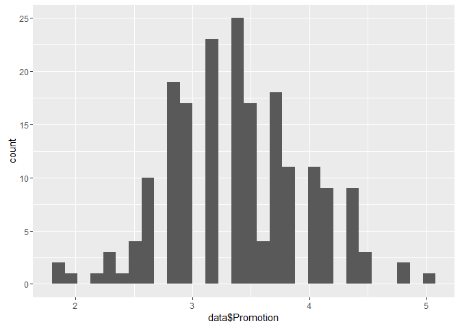
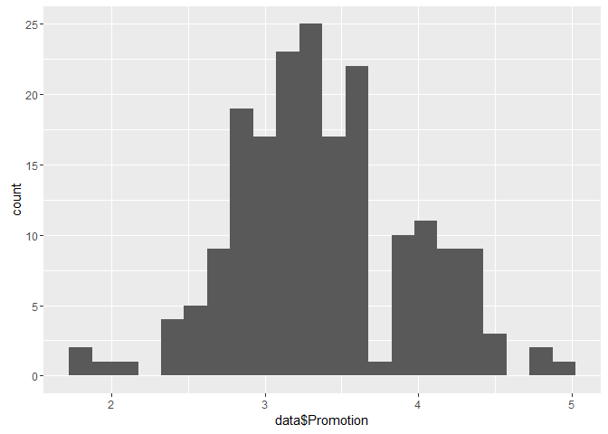
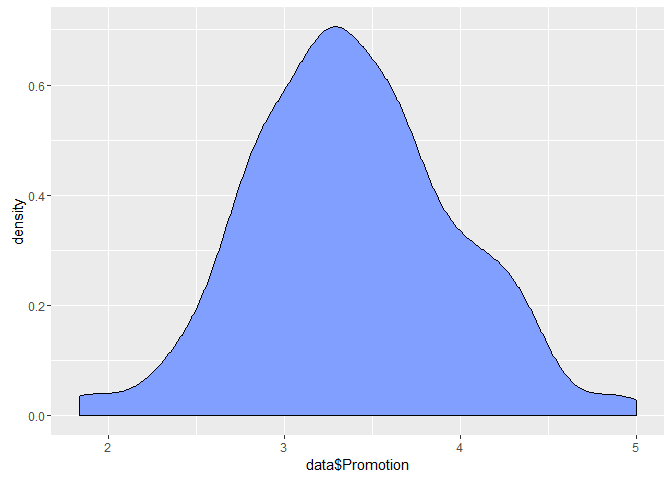
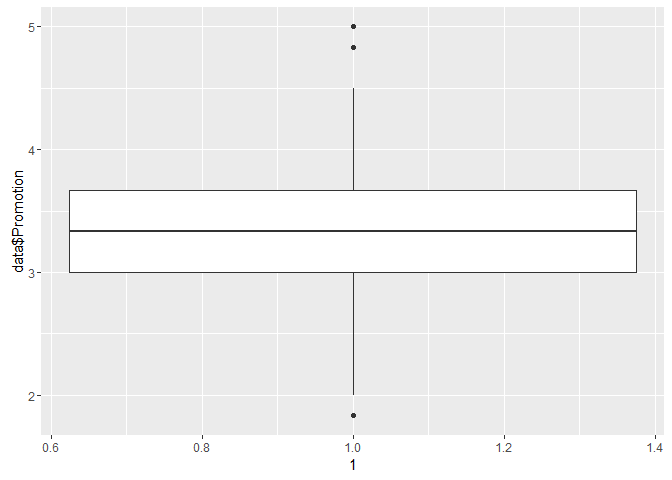
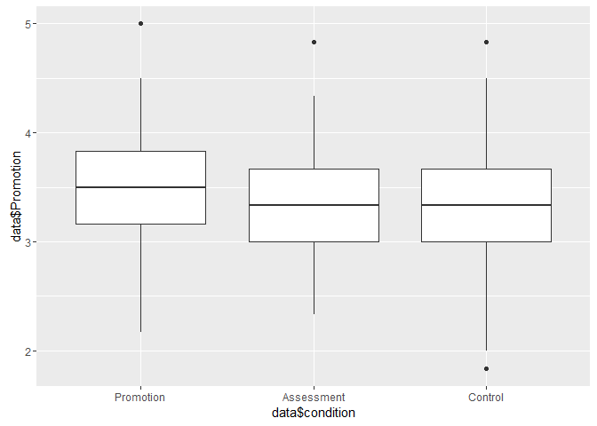
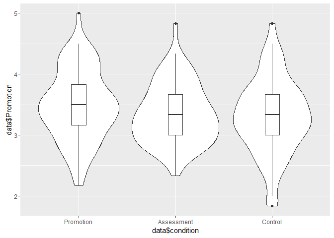

# Descriptive Statistics and Composite Scores
Jeff Hughes  
August 9, 2016  


# Learning R Tutorial: A Process-Focused Approach

## Descriptive Statistics and Composite Scores

Typically, one of the first tasks involved in analyzing a set of data is taking a look at the very simple descriptive statistics of the measures and scales in the study. We want to know if the scores are normally distributed, if they are unimodal, if there are ceiling or floor effects, if they are skewed, etc. Often, visualizing the data helps in this task, but looking at quantitative measures like the mean, standard deviation, skewness, and kurtosis are valuable as well. So in this lesson, we will be covering these analyses.

However, before we can take a look at the scores on our scales, we need to calculate composite scores. We also want to make sure that our measures are reliable. So let's cover that first.

### Reliability and Composite Scores

The "psych" package includes a number of very useful functions for all researchers (not just psychologists!). So let's install and load the psych package, using the functions we learned in the previous lesson:


```r
install.packages("psych")
```


```r
library(psych)
```

Now we can take advantage of the useful functions in the package. In this lesson, we will be using two: the `alpha()` function and the `describe()` function. In a later lesson, we will also use some of the functions in this package for performing factor analyses.

In the dataset that we are using, we have items from a number of scales from the psychological literature: the Regulatory Focus Questionnaire (RFQ; Higgins et al., 2001); the Regulatory Mode Scale (RM; Kruglanski et al., 2000); the Maximizing Tendency Scale (MTS; Diab, Gillespie, & Highhouse, 2008); and the Maximization Inventory (MI; Turner, Rim, Betz, & Nygren, 2012). We also have a number of items that are not established in the literature but are nevertheless items that we expect measure a single coherent construct. We have items measuring task difficulty (difficulty, frustration, and the extent to which participants struggled with the decision task); we have four items about the extent to which participants "reconsidered" options on the decision task (i.e., considered an option, then eliminated it, but then brought it back and considered it again); we have six items about the extent to which participants feel regret; and we have five items about the conviction they feel for their selected option. (There are also eight items about the strategies participants used; we will consider this scale later when we look into factor analysis.)

We would like to ensure that all these scales are reliable and measure a single construct. To do this, we can use the `alpha()` function to examine the Cronbach's alpha. However, one thing to consider is reverse-scored items. The `alpha()` function will actually make a reasonable guess at trying to figure out which items are reverse-scored, and will helpfully reverse them for you. But it's generally better to do it yourself, to be sure it finds the right items. So let's first reverse-score the items that need to be reverse-scored, and then we will examine the Cronbach's alpha.

#### Reverse-Scoring Items

Recoding items is actually quite simple. Let's take a look at one example -- one of the variables from the RFQ that we need to reverse. The RFQ is measured on a five-point scale, so if we want to reverse the scores, we can just subtract the scores from 6:


```r
data$RFQ_1.R <- 6 - data$RFQ_1
```

Here we are taking advantage of R's vector operations. If you recall, the columns in our dataset are stored as vectors, so when we ask for a single column, we will get a vector. Recall also that the `6` in the code above is also a length-1 vector. So when you tell R to subtract one vector from another vector (or add, multiply, divide, etc.), it will go item by item in each vector and perform the calculation one at a time. If one vector is shorter than the other (the `6` in this case is obviously shorter), R will "recycle" the vector. Here are a couple more examples of vector operations:


```r
c(1, 2, 3) + c(4, 5, 6)
```

```
## [1] 5 7 9
```

```r
c(20, 30) - c(1, 2, 3, 4)
```

```
## [1] 19 28 17 26
```

In the second case, the shorter vector gets "recycled" and starts over at the beginning as the calculations continue.

So, returning to our reverse-coding, you can see that the `6 - data$RFQ_1` will go through each row of the "RFQ_1" variable, and subtract that score from 6. The resulting vector will be stored in `data$RFQ_1.R`. (You can name this new data column whatever you want; I like designating reverse-coded items with ".R").

So now we have one item reverse-coded! Let's just go ahead and do the rest, for all the scales we're interested in:


```r
# reverse-code Regulatory Focus Questionnaire items
data$RFQ_2.R <- 6 - data$RFQ_2
data$RFQ_4.R <- 6 - data$RFQ_4
data$RFQ_6.R <- 6 - data$RFQ_6
data$RFQ_8.R <- 6 - data$RFQ_8
data$RFQ_9.R <- 6 - data$RFQ_9
data$RFQ_11.R <- 6 - data$RFQ_11

# reverse-code Regulatory Mode Scale items
data$RM_2.R <- 7 - data$RM_2
data$RM_10.R <- 7 - data$RM_10
data$RM_13.R <- 7 - data$RM_13
data$RM_24.R <- 7 - data$RM_24
data$RM_27.R <- 7 - data$RM_27

# reverse-code single Maximization Inventory item
data$MI_22.R <- 7 - data$MI_22

# reverse-code single regret item
data$regret6.R <- 8 - data$regret6
```

Properly reverse-coding items obviously requires that you know which items need to be reversed, and the scale they were measured on.

#### Reliability

Okay, now that these items are reversed, let's look at reliability! The "psych" package we installed makes this really easy with the `alpha()` function. We'll also use the "dplyr" package, so we can easily select the variables we want. If you have been running the code throughout, you should have already installed the dplyr package. If not, you will have to install it first before running the code below.


```r
library(dplyr)
```


```r
# RFQ: Promotion Focus subscale
alpha(select(data, RFQ_1.R, RFQ_3, RFQ_7, RFQ_9.R, RFQ_10, RFQ_11.R))
```

```
## 
## Reliability analysis   
## Call: alpha(x = select(data, RFQ_1.R, RFQ_3, RFQ_7, RFQ_9.R, RFQ_10, 
##     RFQ_11.R))
## 
##   raw_alpha std.alpha G6(smc) average_r S/N   ase mean   sd
##       0.68      0.68    0.65      0.26 2.1 0.053  3.4 0.57
## 
##  lower alpha upper     95% confidence boundaries
## 0.57 0.68 0.78 
## 
##  Reliability if an item is dropped:
##          raw_alpha std.alpha G6(smc) average_r S/N alpha se
## RFQ_1.R       0.62      0.63    0.59      0.25 1.7    0.063
## RFQ_3         0.68      0.69    0.64      0.31 2.2    0.057
## RFQ_7         0.63      0.63    0.60      0.26 1.7    0.061
## RFQ_9.R       0.63      0.64    0.59      0.26 1.7    0.061
## RFQ_10        0.60      0.60    0.56      0.23 1.5    0.065
## RFQ_11.R      0.63      0.64    0.60      0.26 1.8    0.061
## 
##  Item statistics 
##            n raw.r std.r r.cor r.drop mean   sd
## RFQ_1.R  188  0.65  0.64  0.53   0.44  3.4 0.95
## RFQ_3    188  0.47  0.49  0.31   0.25  3.5 0.86
## RFQ_7    189  0.59  0.63  0.51   0.42  3.5 0.73
## RFQ_9.R  189  0.65  0.63  0.52   0.42  3.0 1.05
## RFQ_10   189  0.69  0.70  0.62   0.52  3.6 0.88
## RFQ_11.R 189  0.66  0.62  0.50   0.42  3.2 1.07
## 
## Non missing response frequency for each item
##             1    2    3    4    5 miss
## RFQ_1.R  0.01 0.16 0.38 0.31 0.14 0.02
## RFQ_3    0.02 0.07 0.37 0.43 0.10 0.02
## RFQ_7    0.00 0.05 0.49 0.37 0.10 0.01
## RFQ_9.R  0.08 0.23 0.37 0.25 0.07 0.01
## RFQ_10   0.01 0.10 0.32 0.44 0.14 0.01
## RFQ_11.R 0.04 0.24 0.29 0.31 0.12 0.01
```

As you can see, the `alpha()` function gives us lots of useful information! Near the top of the output is the "raw_alpha", which is the Cronbah's alpha. We also get the standardized alpha, another measure of reliability called Guttman's Lambda 6 (G6), the average interitem correlation, etc. Further down, we get the reliability when each of the single items is dropped from the scale (i.e., which item contributes the most to the reliability?), as well as some general item statistics. You may be interested in the "raw.r", which is the item-total correlation, and the "r.drop", which is the corrected item-total correlation (after removing that item from the total).

Now, rules of thumb for reliability vary, but one common rule is that reliabilities above .60 are considered adequate. (.70 might be a better rule, but this scale is pretty close to that anyway.)

To save space, I won't print the output for the other scales, but the code is below, and you should run these on your own and examine them. Thankfully, these other scales show good reliabilities above .80.


```r
# RM: Assessment Mode subscale
alpha(select(data, RM_2.R, RM_6, RM_7, RM_9, RM_10.R, RM_11, RM_15, RM_19, RM_20, RM_22, RM_27.R, RM_30))

# MTS
alpha(select(data, MTS_1:MTS_9))

# MI: Alternative Search subscale
alpha(select(data, MI_23:MI_34))

# MI: Decision Difficulty subscale
alpha(select(data, MI_11:MI_21, MI_22.R))

# task difficulty
alpha(select(data, difficulty, frustration, struggle))

# reconsideration of options
alpha(select(data, reconsider1:reconsider4))

# regret
alpha(select(data, regret1:regret5, regret6.R))

# conviction
alpha(select(data, conviction1:conviction5))
```

#### Creating Composite Variables

The reliabilities of these scales gives us reasonable justification for calculating composite scores, i.e., combining them into a single score. There are numerous ways to do this, but one handy function we can take advantage of is the `rowMeans()` function. This function takes a data frame and calculates the mean of each row. So we can take a *subset* of our data including just the columns we want, then give that to the `rowMeans()` function, and it will give us the mean of those variables for each participant. (Notice how important it is to know how to subset your data effectively in R?)

Let's start off trying this for the promotion focus scale.


```r
rowMeans(select(data, RFQ_1.R, RFQ_3, RFQ_7, RFQ_9.R, RFQ_10, RFQ_11.R))
```

```
##   [1] 3.833333 4.500000 2.666667 3.166667 2.666667 4.166667 3.666667
##   [8] 3.500000 4.000000 3.000000 3.333333 4.166667 4.000000 3.000000
##  [15] 3.500000 4.833333 3.166667 2.833333 5.000000 3.333333 2.833333
##  [22] 4.500000       NA       NA 3.500000 3.166667 2.166667 3.166667
##  [29]       NA 3.333333 3.666667 2.500000 3.333333       NA 3.000000
##  [36] 4.000000 3.666667 3.166667       NA       NA 3.166667 4.000000
##  [43] 3.166667 3.500000 3.000000 3.166667 3.500000 3.500000 3.333333
##  [50] 3.500000 3.333333       NA 4.333333 3.666667 3.333333 2.833333
##  [57] 3.166667 3.500000 4.333333       NA 2.833333 2.833333 2.833333
##  [64] 4.333333 2.833333 3.000000 3.333333 3.166667       NA 3.833333
##  [71] 3.166667 3.166667 3.333333 3.833333       NA 3.666667 3.500000
##  [78] 3.500000 3.333333 3.166667 2.333333 3.000000 3.666667 3.833333
##  [85] 3.333333 3.833333 2.666667 2.833333 2.333333 3.000000 2.833333
##  [92] 3.166667 4.500000 3.166667 2.833333 3.666667 4.333333 2.833333
##  [99] 4.166667       NA 2.833333 3.500000 3.833333 3.333333 4.000000
## [106] 4.333333 2.666667 2.666667 3.333333 3.166667 2.500000 3.333333
## [113] 4.166667 3.000000 3.500000 2.500000 3.166667 3.166667       NA
## [120] 4.333333 3.000000 2.666667 2.666667 3.166667 3.666667 4.000000
## [127] 3.666667 4.833333 4.000000 1.833333 3.666667 3.666667 3.333333
## [134] 3.666667 3.833333 2.833333 3.000000       NA 2.500000 3.666667
## [141] 3.500000 3.166667 4.000000 3.666667 2.666667 4.000000 3.333333
## [148] 3.000000 3.500000 3.333333 3.666667 4.333333 3.833333 4.333333
## [155] 3.000000 2.666667 2.833333 3.333333 3.500000 3.000000 3.500000
## [162] 3.333333 2.833333 3.666667 3.000000 2.833333 3.000000 3.833333
## [169] 2.833333 4.333333 3.333333 3.500000 3.666667 4.000000 4.000000
## [176] 3.333333 3.333333 3.666667 3.333333 2.833333 3.166667 1.833333
## [183] 2.000000 4.166667 3.166667 3.333333 4.166667 4.166667 2.333333
## [190] 3.333333 3.833333
```

If you'll notice, we have a number of rows that turned up as NA (missing value). This could be because these participants didn't fill out any of the scale items at all; however, it is important to remember in R that for many functions, like calculating means, standard deviations, etc., if the data has one or more NA values, the whole result will come back as NA. In some cases, this is preferable. However, in the case where we have a number of scale items, which should be theoretically interchangeable in terms of their measurement of the construct, we should be able to relax this. If a participant has an item or two missing, we can still use the rest of the items to get a reasonable approximation of their score on that construct. So in this case, we can use the `na.rm` argument in the above function, which tells it to remove missing values from the calculations and calculate over the rest. Let's try it again:


```r
rowMeans(select(data, RFQ_1.R, RFQ_3, RFQ_7, RFQ_9.R, RFQ_10, RFQ_11.R), na.rm=TRUE)
```

```
##   [1] 3.833333 4.500000 2.666667 3.166667 2.666667 4.166667 3.666667
##   [8] 3.500000 4.000000 3.000000 3.333333 4.166667 4.000000 3.000000
##  [15] 3.500000 4.833333 3.166667 2.833333 5.000000 3.333333 2.833333
##  [22] 4.500000 3.800000 3.600000 3.500000 3.166667 2.166667 3.166667
##  [29] 4.200000 3.333333 3.666667 2.500000 3.333333 3.200000 3.000000
##  [36] 4.000000 3.666667 3.166667 2.800000 3.600000 3.166667 4.000000
##  [43] 3.166667 3.500000 3.000000 3.166667 3.500000 3.500000 3.333333
##  [50] 3.500000 3.333333 3.000000 4.333333 3.666667 3.333333 2.833333
##  [57] 3.166667 3.500000 4.333333 2.600000 2.833333 2.833333 2.833333
##  [64] 4.333333 2.833333 3.000000 3.333333 3.166667 3.600000 3.833333
##  [71] 3.166667 3.166667 3.333333 3.833333 3.000000 3.666667 3.500000
##  [78] 3.500000 3.333333 3.166667 2.333333 3.000000 3.666667 3.833333
##  [85] 3.333333 3.833333 2.666667 2.833333 2.333333 3.000000 2.833333
##  [92] 3.166667 4.500000 3.166667 2.833333 3.666667 4.333333 2.833333
##  [99] 4.166667 4.200000 2.833333 3.500000 3.833333 3.333333 4.000000
## [106] 4.333333 2.666667 2.666667 3.333333 3.166667 2.500000 3.333333
## [113] 4.166667 3.000000 3.500000 2.500000 3.166667 3.166667 2.400000
## [120] 4.333333 3.000000 2.666667 2.666667 3.166667 3.666667 4.000000
## [127] 3.666667 4.833333 4.000000 1.833333 3.666667 3.666667 3.333333
## [134] 3.666667 3.833333 2.833333 3.000000 3.600000 2.500000 3.666667
## [141] 3.500000 3.166667 4.000000 3.666667 2.666667 4.000000 3.333333
## [148] 3.000000 3.500000 3.333333 3.666667 4.333333 3.833333 4.333333
## [155] 3.000000 2.666667 2.833333 3.333333 3.500000 3.000000 3.500000
## [162] 3.333333 2.833333 3.666667 3.000000 2.833333 3.000000 3.833333
## [169] 2.833333 4.333333 3.333333 3.500000 3.666667 4.000000 4.000000
## [176] 3.333333 3.333333 3.666667 3.333333 2.833333 3.166667 1.833333
## [183] 2.000000 4.166667 3.166667 3.333333 4.166667 4.166667 2.333333
## [190] 3.333333 3.833333
```

There we go. Clearly those participants from before had *some* data we could work with! The last thing to do is to assign these mean scores to a new variable in our dataset. Then we can do the same for the other scales we wish to calculate.


```r
data$Promotion <- rowMeans(select(data, RFQ_1.R, RFQ_3, RFQ_7, RFQ_9.R, RFQ_10, RFQ_11.R), na.rm=TRUE)
data$Assessment <- rowMeans(select(data, RM_2.R, RM_6, RM_7, RM_9, RM_10.R, RM_11, RM_15, RM_19, RM_20, RM_22, RM_27.R, RM_30), na.rm=TRUE)
data$HighStandards <- rowMeans(select(data, MTS_1:MTS_9), na.rm=TRUE)
data$AlternativeSearch <- rowMeans(select(data, MI_23:MI_34), na.rm=TRUE)
data$DecisionDifficulty <- rowMeans(select(data, MI_11:MI_21, MI_22.R), na.rm=TRUE)

data$TaskDifficulty <- rowMeans(select(data, difficulty, frustration, struggle), na.rm=TRUE)
data$Reconsideration <- rowMeans(select(data, reconsider1:reconsider4), na.rm=TRUE)
data$Regret <- rowMeans(select(data, regret1:regret5, regret6.R), na.rm=TRUE)
data$Conviction <- rowMeans(select(data, conviction1:conviction5), na.rm=TRUE)
```

Note that you can name these composite scores any way you want, but of course, it helps to choose a descriptive name :) In the case of the MTS scale, we will be using it as a measure of "high standards", one component of maximizing that has been discussed in much of the research on maximization (e.g., Nenkov et al., 2008). So I've named it accordingly, to make it clearer later.

### Descriptive Statistics

As you might expect, R has functions to calculate all the typical descriptive statistics. Here are some of the common ones. We have measures of central tendency:


```r
mean(data$Promotion, na.rm=TRUE)
```

```
## [1] 3.380105
```

```r
median(data$Promotion, na.rm=TRUE)
```

```
## [1] 3.333333
```

And measures of variability:


```r
var(data$Promotion, na.rm=TRUE)
```

```
## [1] 0.3305144
```

```r
sd(data$Promotion, na.rm=TRUE)
```

```
## [1] 0.5749038
```

We can calculate the range in a couple different ways:


```r
min(data$Promotion, na.rm=TRUE)
```

```
## [1] 1.833333
```

```r
max(data$Promotion, na.rm=TRUE)
```

```
## [1] 5
```

```r
range(data$Promotion, na.rm=TRUE)
```

```
## [1] 1.833333 5.000000
```

And there's a function that shows (by default) the min and max values, the median, and the interquartile range all bundled up into one


```r
quantile(data$Promotion, na.rm=TRUE)
```

```
##       0%      25%      50%      75%     100% 
## 1.833333 3.000000 3.333333 3.666667 5.000000
```

Note that I've specified `na.rm=TRUE` for all of these. Yes, it's typically what you want. No, I don't know why they didn't just make it the default.

In addition to these individual functions, the psych package has a very handy `describe()` function that gives you a nice summary of one or more variables:


```r
describe(select(data, Promotion, Assessment, HighStandards, AlternativeSearch, DecisionDifficulty))
```

```
##                    vars   n mean   sd median trimmed  mad  min  max range
## Promotion             1 191 3.38 0.57   3.33    3.37 0.49 1.83 5.00  3.17
## Assessment            2 191 4.13 0.69   4.17    4.14 0.70 1.92 6.00  4.08
## HighStandards         3 191 4.80 0.90   4.78    4.79 0.99 2.33 6.89  4.56
## AlternativeSearch     4 191 4.24 0.84   4.25    4.24 0.86 1.83 6.00  4.17
## DecisionDifficulty    5 191 4.00 0.88   3.92    4.01 0.86 1.17 6.00  4.83
##                     skew kurtosis   se
## Promotion           0.11     0.01 0.04
## Assessment         -0.09     0.21 0.05
## HighStandards      -0.02    -0.27 0.07
## AlternativeSearch   0.00    -0.46 0.06
## DecisionDifficulty -0.15    -0.11 0.06
```

Most of the labels should be obvious, but to clarify a couple of them: "trimmed" refers to the mean after trimming the top and bottom 10% (by default), and "mad" refers to the [median absolute deviation](https://en.wikipedia.org/wiki/Median_absolute_deviation), a measure of variability somewhat similar to the standard deviation. Note also that the creators of the psych package have helpfully made `na.rm=TRUE` the default for the `describe()` function. Hooray!

An extra nifty related function in the psych package is `describeBy()`, which is much the same as `describe()`, but allows you to specify a grouping variable, like so:


```r
describeBy(select(data, Promotion, Assessment, HighStandards, AlternativeSearch, DecisionDifficulty), group=data$condition)
```

```
## group: Promotion
##                    vars  n mean   sd median trimmed  mad  min  max range
## Promotion             1 65 3.49 0.59   3.50    3.49 0.49 2.17 5.00  2.83
## Assessment            2 65 4.13 0.68   4.17    4.14 0.74 1.92 6.00  4.08
## HighStandards         3 65 4.92 0.91   5.00    4.94 0.82 2.67 6.89  4.22
## AlternativeSearch     4 65 4.41 0.90   4.33    4.42 0.90 1.83 6.00  4.17
## DecisionDifficulty    5 65 4.02 0.96   3.92    4.05 1.11 1.17 5.83  4.67
##                     skew kurtosis   se
## Promotion           0.10    -0.40 0.07
## Assessment         -0.32     1.01 0.08
## HighStandards      -0.25    -0.31 0.11
## AlternativeSearch  -0.10    -0.41 0.11
## DecisionDifficulty -0.40     0.11 0.12
## -------------------------------------------------------- 
## group: Assessment
##                    vars  n mean   sd median trimmed  mad  min  max range
## Promotion             1 64 3.35 0.49   3.33    3.32 0.49 2.33 4.83  2.50
## Assessment            2 64 4.09 0.71   4.17    4.10 0.57 2.25 5.67  3.42
## HighStandards         3 64 4.77 0.93   4.67    4.74 0.99 2.33 6.78  4.44
## AlternativeSearch     4 64 4.19 0.79   4.25    4.20 0.93 2.33 5.75  3.42
## DecisionDifficulty    5 64 3.92 0.84   3.92    3.93 0.86 2.08 6.00  3.92
##                     skew kurtosis   se
## Promotion           0.51    -0.13 0.06
## Assessment         -0.15    -0.09 0.09
## HighStandards       0.14    -0.21 0.12
## AlternativeSearch  -0.19    -0.76 0.10
## DecisionDifficulty -0.06    -0.44 0.11
## -------------------------------------------------------- 
## group: Control
##                    vars  n mean   sd median trimmed  mad  min  max range
## Promotion             1 62 3.30 0.63   3.33    3.30 0.49 1.83 4.83  3.00
## Assessment            2 62 4.18 0.70   4.08    4.17 0.74 2.83 6.00  3.17
## HighStandards         3 62 4.71 0.87   4.67    4.70 0.99 2.33 6.67  4.33
## AlternativeSearch     4 62 4.13 0.81   4.00    4.10 0.86 2.25 6.00  3.75
## DecisionDifficulty    5 62 4.06 0.84   3.96    4.05 0.74 2.33 5.83  3.50
##                     skew kurtosis   se
## Promotion          -0.07    -0.03 0.08
## Assessment          0.22    -0.57 0.09
## HighStandards       0.04    -0.33 0.11
## AlternativeSearch   0.17    -0.50 0.10
## DecisionDifficulty  0.13    -0.55 0.11
```

Now, because we have three conditions, we get our descriptive statistics split between the three groups. Neat-o!

So in general, taking a look at these descriptives, it looks like we're in pretty good shape. Our means aren't too high or too low, which might suggest a ceiling/floor effect; our standard deviations look sufficiently large; our variables aren't highly skewed or highly kurtotic. In short, we're looking alright. However, sometimes it can be helpful to visualize our data graphically.

### Visualizing Data (Univariate)

We will cover more complex graphs in a later lesson, but for now, let's learn some of the very basic univariate graphs. R has a built-in graphics package that can create very useful graphs. For more information, check out the documentation for `plot()`, `hist()`, `density()`, and `boxplot()`. However, one of the most popular graphing packages in R is "ggplot2". By default, it creates very nice-looking graphs, and with a little extra effort these plots can be downright beautiful. So let's install and load the "ggplot2" package.


```r
install.packages("ggplot2")
```


```r
library(ggplot2)
```

The ggplot2 package has two primary functions. The `ggplot()` function is the workhorse -- it is the function that does the work in creating a plot. However, getting the hang of the way the `ggplot()` function operates can be a little challenging, and so the package also has a `qplot()` function, which stands for "quick plot". This function has a somewhat simplified syntax that makes it easier to just quickly throw something up. So for now, let's use that, and we'll save discussion of the `ggplot()` function for our lesson on graphing.

Histograms are often extremely useful for visualizing data, so let's start off with one of those.


```r
qplot(data$Promotion)
```

```
## `stat_bin()` using `bins = 30`. Pick better value with `binwidth`.
```

 

With the `qplot()` function, the default when you give it a single variable is to create a histogram. Here we can see that it works reasonably well, but it appears that the bins might be a little too narrow -- there are big "chunks" missing in the middle of the distribution. We can adjust the width of the bins using the helpfully-named argument `binwidth`.


```r
qplot(data$Promotion, binwidth=.15)
```

 

I played around with a few different widths, and settled on .15 as a reasonable width. But try running the above code and try out a few of your own. Wider bins mean each bar covers a greater range of the data -- you'll get wider bars, but fewer of them. Narrower bins do the opposite.

Sometimes, histograms can be a little misleading, suggesting discrete steps even though the data is continuous. In those cases, a density plot can be a better choice. It's quite easy to change a histogram to a density plot:


```r
qplot(data$Promotion, geom="density", fill=I("#809fff"))
```

 

The major difference is setting the `geom` argument to "density". The default density plot is just a black line, so I also just added an argument to set the fill colour to a nice, pastel blue to calm your emotions and soothe your soul. Isn't it so soothing?

Anyway, there are those out there who swear by the boxplot. I wouldn't want to disappoint them, so here's how to make one of those:


```r
qplot(y=data$Promotion, x=1, geom="boxplot")
```

 

In order to get a single boxplot, not splitting across any other variables, we need to trick the `qplot()` function a little bit. We specify the variable we want to graph with the `y` argument, but then we add a dummy "1" in the `x` argument. Yeah, it's kinda weird. But that's because a single boxplot is typically not what people want -- it's much more useful when you compare boxplots across groups! So here's an example of how we would do that:


```r
qplot(y=data$Promotion, x=data$condition, geom="boxplot")
```

 

As a side note, because we have set up our "condition" variable as a factor, `qplot()` takes our factor labels and puts them into the graph for us -- you can see at the bottom "Promotion", "Assessment", and "Control", which were our three conditions. Ain't that neat!

But for those of you who like boxplots, let me show you one more type of plot that combines the nice cleanliness of the boxplot with the detail of the density plot. Hold onto your socks, folks, because we're going to do two things: We're going to create a *violin* plot, and we're going to overlay a boxplot on top of that!


```r
qplot(y=data$Promotion, x=data$condition, geom="violin") + geom_boxplot(width=.2)
```

 

Here you can see that although our boxplots looked pretty similar across the three conditions, the actual shape of the data was somewhat different.

Okay, that's all for this lesson! As I said, we will go into graphing in more detail in a later lesson. But this lesson has given you the tools to examine your variables closely: Taking a look at the reliability of scales, examining the descriptive statistics, and viewing your univariate data in a graphical format. In the next lesson, we're going to start getting into some basic inferential statistics.
