# Graphing Like a Boss
Jeff Hughes  
September 11, 2016  


# Learning R Tutorial: A Process-Focused Approach

## Graphing Like a Boss

In a previous lesson on descriptive statistics, we started to learn a little bit about how to graph using the "ggplot2" package, and the `qplot()` function. But this package has a more complex function called `ggplot()`&mdash;basically, `qplot()` just calls `ggplot()` behind the scenes. So it's worth learning about the real way that ggplot2 handles graphing, so you can take advantage of all the flexibility it offers.

Let me say, to start off, that the [official documentation](http://docs.ggplot2.org/current/) for ggplot2 is not exactly easy to read. It is bare-bones documentation, not really providing explanation. At the same time, however, it can be a good resource in terms of providing examples for the different functions. In general, though, Google is your friend here&mdash;if you're not quite sure how to get a specific feature on your graph, try to search for answers on Google. Chances are, someone else has tried to do the same thing.

### The Grammar of Graphics

The ggplot2 package is based on a "grammar of graphics," with the idea being that, like building a grammatically correct sentence, a complex graph too can be built up with a particular structure that helps make sense of the various components. The author of the ggplot2 package, Hadley Wickham (a *huge* name in R development), has written a paper about his philosophy regarding this structure, which is quite readable (see [A Layered Grammar of Graphics](http://vita.had.co.nz/papers/layered-grammar.html)). As the name of the paper suggests, the key to understanding ggplot2 is that it relies on *layers*. If you think, for example, of a scatterplot with a regression line plotted on it, this graph is composed of (at least) two layers&mdash; the dots comprising the scatterplot, and the regression line. Each layer has several features: the underlying **data** describing it; the **aesthetic mappings** indicating that, for instance, this variable in the data is mapped to our x-position, and that variable is mapped to our y-position; a **scale transformation**, translating the units in the data to visual units in the graph (e.g., a difference of one unit should correspond to a distance of 0.2cm); and a set of **geometric objects**, like lines, dots, bars, etc. Often, layers may share some of these components, like using the same data, or the same scale. But these layers can function independently (think of complex plots, for example, that have a bar graph on one scale and an overlaying line graph on a completely different scale).

The other key thing to understand about ggplot2 is that it expects "[tidy data](http://vita.had.co.nz/papers/tidy-data.html)"&mdash;many times this is referred to as "long format". In terms of creating graphs, what this means is that every row in your dataset should refer to a single object to be graphed. If you want to graph a line with four points, you don't want one row with four columns&mdash;you want four rows with two columns, each row representing one point, with the two columns representing the *x* and *y* points. Perhaps this sounds trivial to you, but understanding this is key to avoiding many frustrations with ggplot2. The package has some convenience functions that will sometimes transform things for you, but these can't always be relied upon once you get into more complex plots. It's much easier to make sure your data is in the right format *first*, using the rule that each row is a single observation.

### Some Simple Plots

Let's start off with a simple scatterplot, to get our feet wet with the full ggplot2 syntax. We will start off with a scatterplot, plotting "DecisionDifficulty" against "Regret". (We want to see whether having greater difficulty with decisions in general is associated with greater regret on this particular decision task.) First, we should think about whether our data is in the right format. Each row in our data represents a single participant, and neither of the variables we are interested in are repeated measures (i.e., multiple observations for one participant), so we are good to go! Each row represents one observation&mdash;one point on the graph, if you will.


```r
library(ggplot2)
```

```
## Warning: package 'ggplot2' was built under R version 3.2.4
```

```r
ggplot(data, aes(x=DecisionDifficulty, y=Regret)) + geom_point()
```

```
## Warning: Removed 4 rows containing missing values (geom_point).
```

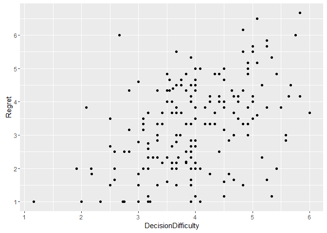<!-- -->

Okay, so the first thing we do is use the `ggplot()` function. This basically initializes a graph for us, which is kind of like our foundation upon which we build the different layers. For instance, here's what it looks like if we just call `ggplot()`:


```r
ggplot()
```

<!-- -->

Not really that exciting, is it? And here's what it looks like if we just give it our data and aesthetic mappings with no other layers:


```r
ggplot(data, aes(x=DecisionDifficulty, y=Regret))
```

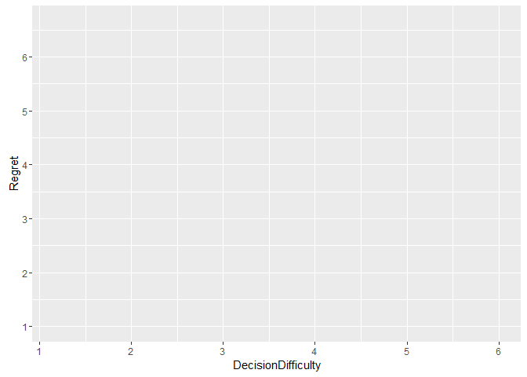<!-- -->

Again, not very informative, though we at least get some scale information. So the next thing we did above was add a *layer*. Layers are identified by their geometric object, or "geom" for short. Here, we used the `geom_point()` geom. Note that we didn't have to give this layer any other information. The data and aesthetic mappings we provide in the `ggplot()` function are essentially "defaults". If you create a layer without specifying any other information, the layer will borrow from the default data and aesthetics. But you can also override the defaults within any particular layer, which we will see later.

So cool, we've got ourselves a scatterplot. That wasn't so hard, was it? But our plot is missing a key piece of information that might be relevant: what condition the participants were in. How could we represent this? Well, we would want to change the points in our scatterplot in some way. We could use colour,[^colour] or shape, or size, for example. Size might not be the best choice in this case, but let's try colour and shape.

[^colour]: Note that Hadley Wickham, the creator of the ggplot2 package, is British, so in his packages he uses the British English, with spellings like "colour" and "standardise". I'm Canadian, so I appreciate the extra "u"s. However, if you prefer the American English, or you're just too lazy to type the extra letter, "color" also works just fine.


```r
ggplot(data, aes(x=DecisionDifficulty, y=Regret, colour=condition)) + geom_point()
```

```
## Warning: Removed 4 rows containing missing values (geom_point).
```

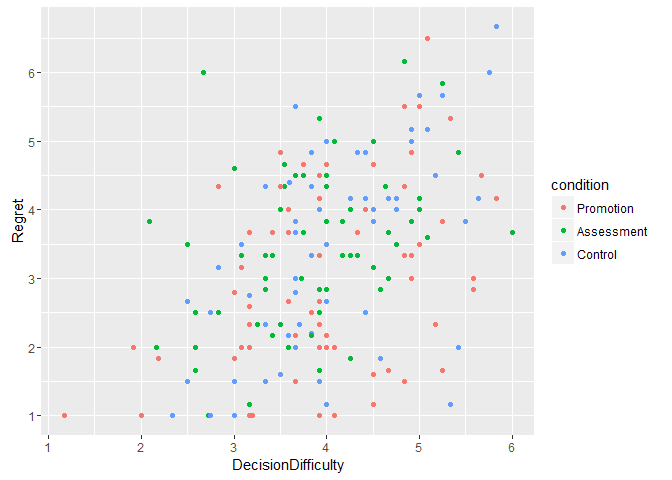<!-- -->

```r
ggplot(data, aes(x=DecisionDifficulty, y=Regret, shape=condition)) + geom_point()
```

```
## Warning: Removed 4 rows containing missing values (geom_point).
```

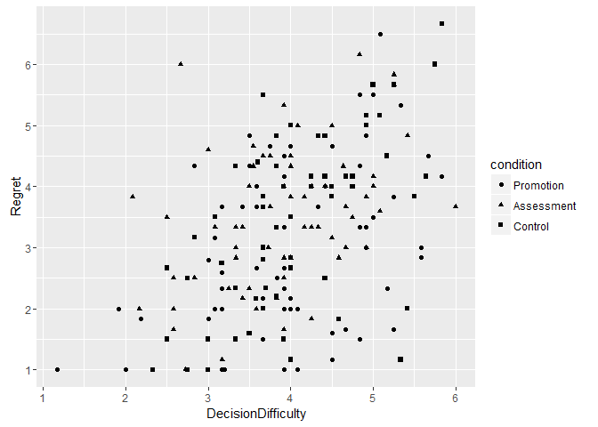<!-- -->

```r
ggplot(data, aes(x=DecisionDifficulty, y=Regret, colour=condition, shape=condition)) + geom_point()
```

```
## Warning: Removed 4 rows containing missing values (geom_point).
```

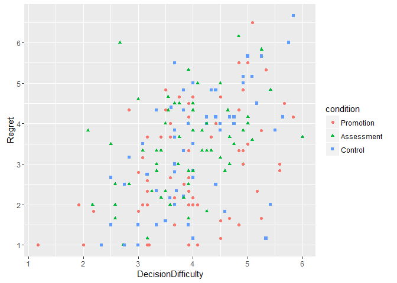<!-- -->

Note that all we had to do was add an extra aesthetic mapping, specifying that the "condition" variable in our dataset should be used to change colours, or shapes, or both. Because `geom_point()` uses the default aesthetics unless it's overridden, it now changes shapes and colours. Note that ggplot has also helpfully added a legend to the side for us.

It should be noted that different geoms use different aesthetics. "shape" means something to the point geom, for example, but doesn't really make much sense for the line geom. "linetype", on the other hand, means something to the line geom, but not to the point geom. But "colour" can be used for both.

### Crossing the Line

Okay, let's try adding a fitted line to this scatterplot. We'll just use `geom_line()`, right?


```r
ggplot(data, aes(x=DecisionDifficulty, y=Regret, colour=condition)) + geom_point() + geom_line()
```

```
## Warning: Removed 4 rows containing missing values (geom_point).
```

<!-- -->

Whoops! What happened? Well, the problem is that `geom_line()` uses the default dataset that we provided to `ggplot()`. And it expects one row per observation. So ggplot did a valiant job of trying to interpret these observations as points on the line. Note that it also split them by condition and made the lines different colours. Now, in some cases, lines like this might be what you want. But in this case, we don't want to use the *raw data* to create our line; we want to calculate a regression model and use the *fitted data* to plot the line we want!

I'll show you the harder way first, and then show you a nice little convenience function that has some nice features. First, what we could do is calculate a linear regression, and then provide the slope and intercept to ggplot. Like so:


```r
model <- lm(Regret ~ DecisionDifficulty, data)
summary(model)
```

```
## 
## Call:
## lm(formula = Regret ~ DecisionDifficulty, data = data)
## 
## Residuals:
##     Min      1Q  Median      3Q     Max 
## -3.0658 -0.8253  0.0451  0.9079  3.5473 
## 
## Coefficients:
##                    Estimate Std. Error t value Pr(>|t|)    
## (Intercept)         0.67301    0.40337   1.668   0.0969 .  
## DecisionDifficulty  0.66739    0.09874   6.759 1.76e-10 ***
## ---
## Signif. codes:  0 '***' 0.001 '**' 0.01 '*' 0.05 '.' 0.1 ' ' 1
## 
## Residual standard error: 1.193 on 185 degrees of freedom
##   (4 observations deleted due to missingness)
## Multiple R-squared:  0.198,	Adjusted R-squared:  0.1937 
## F-statistic: 45.68 on 1 and 185 DF,  p-value: 1.757e-10
```

```r
coefs <- coef(model)

ggplot(data, aes(x=DecisionDifficulty, y=Regret, colour=condition)) + geom_point() + geom_abline(intercept=coefs[1], slope=coefs[2])
```

```
## Warning: Removed 4 rows containing missing values (geom_point).
```

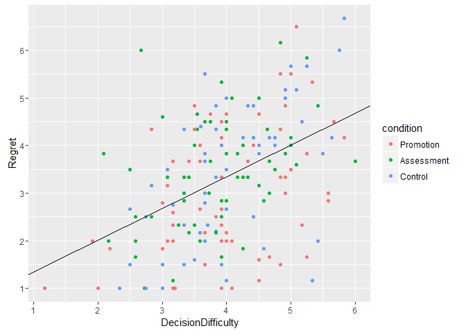<!-- -->

First, we use the `lm()` function to fit a linear regression model. I've shown you the summary of the results, just to make things clear; we get an intercept of about 0.67 and a slope of about 0.67. Then we can use the `coef()` function to capture the coefficients of that model (i.e., the intercept and slope). Finally, instead of the `geom_line()` function, we use `geom_abline()`, which means "plot a line from a to b". This geom doesn't use the default data; instead, it needs an intercept and slope, which we provide specifically to that geom. And then we get a nice fitted line!

Okay, so you can do that, but that seems like a lot of extra work just for a straight line! (And it is, though this method is the more flexible approach, if you want a more complex model including covariates, for example.) Luckily, ggplot has a nice little convenience function with some nifty features, called `geom_smooth()`. Let's try it out and see what it gives us:


```r
ggplot(data, aes(x=DecisionDifficulty, y=Regret)) + geom_point(aes(colour=condition)) + geom_smooth()
```

```
## Warning: Removed 4 rows containing non-finite values (stat_smooth).
```

```
## Warning: Removed 4 rows containing missing values (geom_point).
```

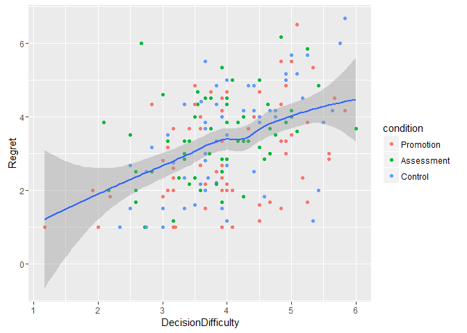<!-- -->

The line that we get here (the one that looks like an attempt at a straight line, drawn by a four-year-old) is actually a loess line, which `geom_smooth()` chooses by default. A loess line basically is a regression line estimated for localized subsets of the data, in order to provide an indication of where in the data the relationship might not be linear. Luckily, in this case it still looks pretty linear. Note that we also get a nice "band" or "ribbon" around hte line indicating the 95% confidence interval across the whole range. As you might expect, as we get further out along the x-axis, where there is less data, our confidence interval gets wider. Neat![^aes]

[^aes]: Note also that I moved the "colour" aesthetic to the `geom_point()` layer specifically. If you don't do this, the `geom_smooth()` also grabs that aesthetic, and you get *three* fitted lines in three different colours.

Okay, but we didn't want a loess line, we wanted a regular ol' linear regression line. Piece of cake:


```r
ggplot(data, aes(x=DecisionDifficulty, y=Regret)) + geom_point(aes(colour=condition)) + geom_smooth(method="lm")
```

```
## Warning: Removed 4 rows containing non-finite values (stat_smooth).
```

```
## Warning: Removed 4 rows containing missing values (geom_point).
```

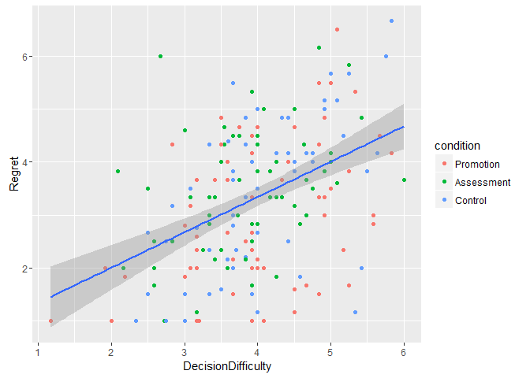<!-- -->

Here we just specify that `geom_smooth()` should use the "lm" method (linear model), and now it gives us the regression line we wanted&mdash;again, with a 95% CI band. If you really don't want the CI band, you can specify `se=FALSE` to the `geom_smooth()` layer; if you want to use some other interval, like standard error instead, you can use the `level` argument, like `level=0.68` (i.e., the middle 68% of the normal distribution, corresponding to one SE).

### Other Types of Graphs

This lesson is intended to provide more of the logic behind the ggplot2 package rather than comprehensive documentation, but I would be remiss if I didn't at least show you a couple other basic geoms. For example, we can make histograms:


```r
ggplot(data, aes(x=DecisionDifficulty)) + geom_histogram(bins=25)
```

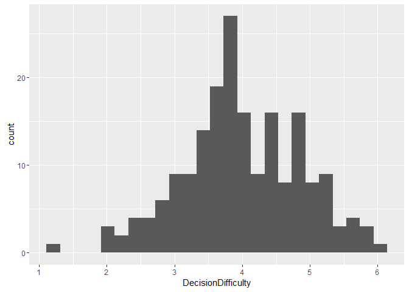<!-- -->

Or bar graphs:


```r
get_means <- function(data) {
    return(c(Regret=mean(data$Regret, na.rm=TRUE)))
}

means <- ddply(select(data, condition, Regret), .(condition), get_means)

ggplot(means, aes(x=condition, y=Regret)) + geom_bar(stat="identity")
```

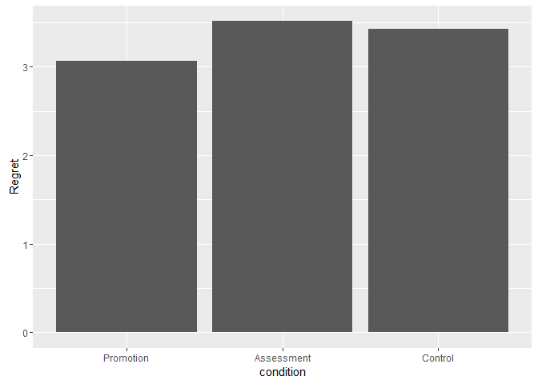<!-- -->

(Note that what we're using the logic of the last lesson to calculate our within-group means, and then using *that* as the dataset for plotting the graph. One row per observation, remember!)

In a previous lesson, we also saw how to create density plots, boxplots, and violin plots. And there are lots more! You can plot points onto maps, draw polygons, use polar coordinate systems, and more. I can only scratch the surface here, but if you have a particular plot in mind, try searching Google for "r ggplot2 [type of plot]".

### Labels, Scales, and Facets

The ggplot2 package tries to be helpful in adding some default details to your plots. For example, it uses the variable names for the axes on your graph. But you may often want to override those. It's easy to do that, using the `labs()` function:


```r
ggplot(data, aes(x=DecisionDifficulty, y=Regret, colour=condition)) + geom_point() + labs(title="Decision Difficulty Predicting Regret", x="Decision Difficulty (1-7)", y="Regret (1-7)", colour="Condition")
```

```
## Warning: Removed 4 rows containing missing values (geom_point).
```

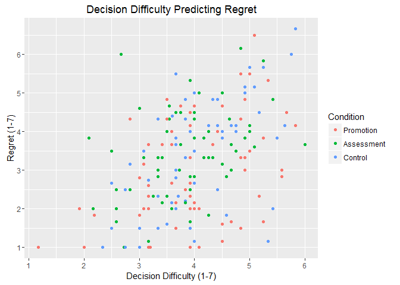<!-- -->

You may also sometimes find that the default scales don't work for you. By default, ggplot will use the minimum and maximum responses on the variable, plus a little bit of a "margin". But perhaps you want to "zoom in" to one part of the graph. Or perhaps you want to show the full range of the variable scale, regardless of where the minimum and maximum responses were. For instance, the "DecisionDifficulty" scale actually goes from 1 to 7, but nobody scored higher than a 6. We might still want to represent this, however:


```r
ggplot(data, aes(x=DecisionDifficulty, y=Regret, colour=condition)) + geom_point() + labs(title="Decision Difficulty Predicting Regret", x="Decision Difficulty (1-7)", y="Regret (1-7)", colour="Condition") + lims(x=c(1, 7), y=c(1, 7))
```

```
## Warning: Removed 4 rows containing missing values (geom_point).
```

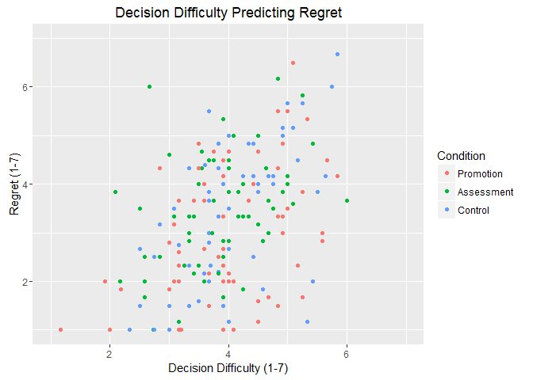<!-- -->

<aside>Note that the tick marks on the axes now look weird, showing the even numbers rather than the odd numbers. You can override this using the `scale_x_continuous()` and `scale_y_continuous()` functions.</aside>

One other key feature in ggplot is the faceting feature. Sometimes, there gets to be too much data on an individual graph, and it is easier to instead display multiple related graphs. That's where faceting comes in. Facets essentially use a "formula" structure to indicate rows and columns in your plot. For example:


```r
ggplot(data, aes(x=DecisionDifficulty, y=Regret)) + geom_point() + facet_grid(. ~ condition)
```

```
## Warning: Removed 4 rows containing missing values (geom_point).
```

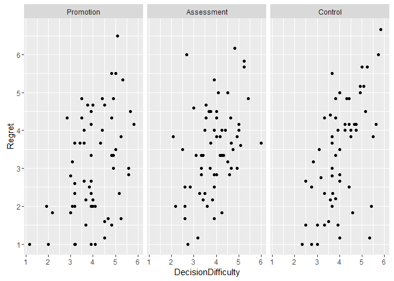<!-- -->

Variables on the right-hand side of the formula facet the plot by columns, as shown above. Note that ggplot nicely uses the same y-axis scale for all three graphs (though you can override this behaviour with `scales="free"`, `scales="free_y"`, or `scales="free_x"`). Variables on the left-hand side of the formula facet the plot by rows:


```r
ggplot(data, aes(x=DecisionDifficulty, y=Regret)) + geom_point() + facet_grid(condition ~ .)
```

```
## Warning: Removed 4 rows containing missing values (geom_point).
```

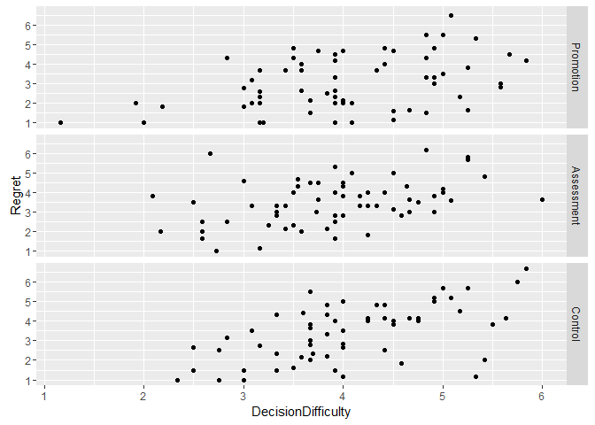<!-- -->

And you can facet on multiple variables:


```r
data_with_gender <- filter(data, gender != "")

ggplot(data_with_gender, aes(x=DecisionDifficulty, y=Regret)) + geom_point() + facet_grid(gender ~ condition)
```

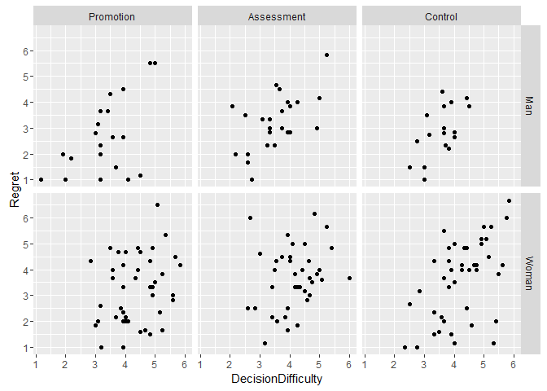<!-- -->

### Themes and Colours

One nice feature of ggplot2 is that it has a full theme system, with several built-in themes and support for creating custom themes. Again, I can't hope to cover everything, but let's take a look at the basics.

The default theme in ggplot2 is called `theme_gray()`. However, there are several more built-in themes. [Here's the complete list](http://docs.ggplot2.org/current/ggtheme.html), but let's take a look at a couple more:


```r
ggplot(data, aes(x=DecisionDifficulty, y=Regret, colour=condition)) + geom_point() + theme_bw()
```

```
## Warning: Removed 4 rows containing missing values (geom_point).
```

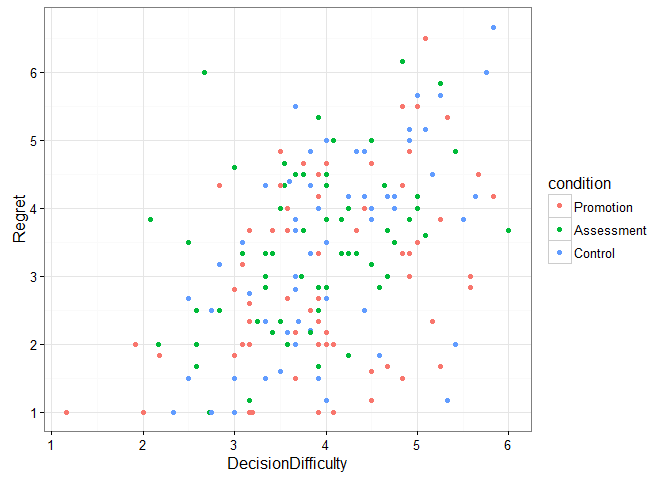<!-- -->


```r
ggplot(data, aes(x=DecisionDifficulty, y=Regret, colour=condition)) + geom_point() + theme_dark()
```

```
## Warning: Removed 4 rows containing missing values (geom_point).
```

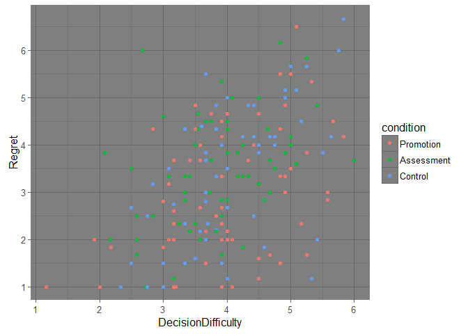<!-- -->


```r
ggplot(data, aes(x=DecisionDifficulty, y=Regret, colour=condition)) + geom_point() + theme_minimal()
```

```
## Warning: Removed 4 rows containing missing values (geom_point).
```

<!-- -->

If none of these themes strike your fancy, you can create your own theme. The [official documentation](http://docs.ggplot2.org/dev/vignettes/themes.html) on this is pretty thorough, so you should check that out. But basically, you just specify the colours, fonts, etc. that you want. You can also modify an existing theme, so you don't have to start from scratch:


```r
ggplot(data, aes(x=DecisionDifficulty, y=Regret, colour=condition)) + geom_point() + theme_minimal() + theme(
    axis.text=element_text(size=14),
    legend.key=element_rect(fill="navy"),
    legend.background=element_rect(fill="white"),
    legend.position=c(0.14, 0.80),
    panel.grid.major=element_line(colour="grey40"),
    panel.grid.minor=element_blank(),
    panel.background=element_rect(fill="navy")
  )
```

```
## Warning: Removed 4 rows containing missing values (geom_point).
```

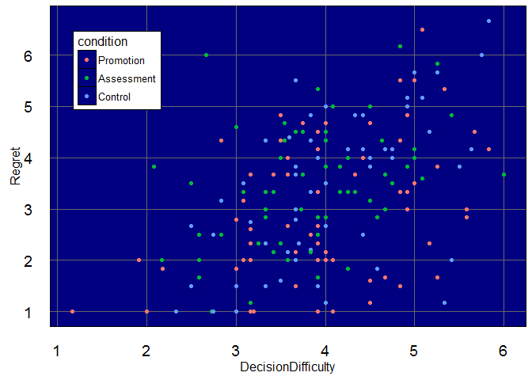<!-- -->

I know what you're saying: "That looks hideous, change it back, change it back!" Well...it's just an example. Don't use this theme. Please, for the love of God, don't use this theme. But it gives you a sense of some of the parameters that can be changed.

Even if you don't want to create your own theme, you might want to take a little more control over the colours in your graph. These can be specified individually, using hard-coded values for `colour` and `fill`, like so:


```r
ggplot(data, aes(x=DecisionDifficulty, y=Regret)) + geom_point(colour="red")
```

```
## Warning: Removed 4 rows containing missing values (geom_point).
```

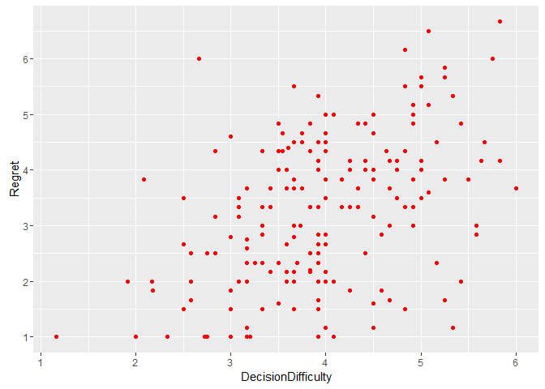<!-- -->

However, if you are already using the `colour` argument to specify a variable to use to differentiate different points, you'll need to use a colour palette. The palette below uses *hex values* to specify the colours, as this is the easiest way to get the exact colour you want. You can use a colour picker like [this one](http://www.colorpicker.com) to get the hex values more easily.


```r
cbPalette <- c("#999999", "#E69F00", "#56B4E9", "#009E73", "#F0E442", "#0072B2", "#D55E00", "#CC79A7")

ggplot(data, aes(x=DecisionDifficulty, y=Regret, colour=condition)) + geom_point() + scale_colour_manual(values=cbPalette)
```

```
## Warning: Removed 4 rows containing missing values (geom_point).
```

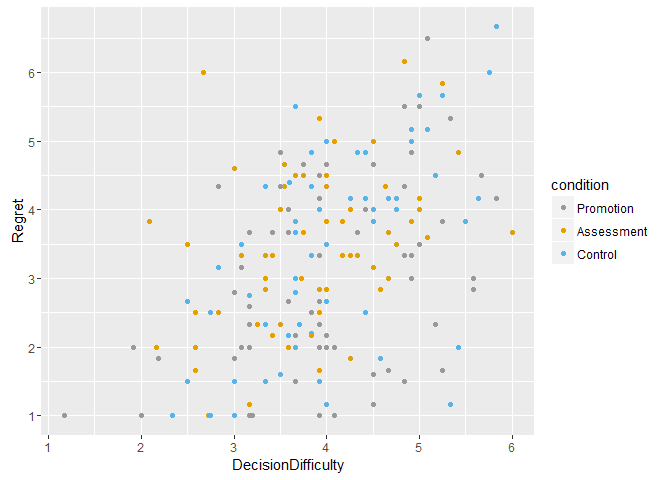<!-- -->

The above palette is taken from the [Cookbook for R](http://www.cookbook-r.com/Graphs/Colors_(ggplot2)/), and is specifically a colourblind-friendly palette. Basically, even though we've specified eight colours, ggplot will use as many colours as are needed and ignore the rest.

Another option is to use the `scale_colour_brewer()` or `scale_fill_brewer()` functions to use other built-in palettes. A list of the palettes available is provided [here](http://docs.ggplot2.org/current/scale_brewer.html). For example, here is the "Dark2" palette:


```r
ggplot(data, aes(x=DecisionDifficulty, y=Regret, colour=condition)) + geom_point() + scale_colour_brewer(palette="Dark2")
```

```
## Warning: Removed 4 rows containing missing values (geom_point).
```

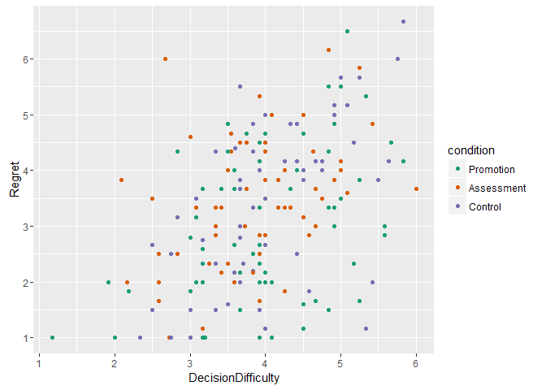<!-- -->

The nice thing about the colour brewer palettes is that they can be used with either discrete or continuous scales. The downside is that some of the colours just don't really show up well, at least on the default theme with the gray background.

For more information about adjusting scales, labels, themes, colours, and more, check out this handy [cheat sheet](http://zevross.com/blog/2014/08/04/beautiful-plotting-in-r-a-ggplot2-cheatsheet-3/). Also, be sure to look at the "[ggthemes](https://github.com/jrnold/ggthemes)" package, which has some more ready-made themes available.

### Saving Plots

The first thing to note here is that ggplot plots are just objects, like everything else in R, and can be used like objects. This means we can assign a reference to them and add layers on later:


```r
graph <- ggplot(data, aes(x=DecisionDifficulty, y=Regret, colour=condition))

graph <- graph + geom_point()

graph <- graph + theme_minimal()

graph
```

```
## Warning: Removed 4 rows containing missing values (geom_point).
```

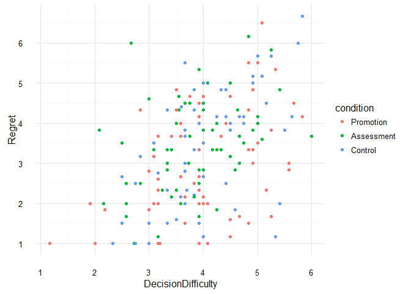<!-- -->

This can be handy, especially if you have a "base" graph and want to add different features to it for different contexts (e.g., an overall scatterplot of everyone, and then a plot faceted by condition).

If you use RStudio, running the above code should display the plot you created in the "Plots" tab in the bottom-right corner. From here, you can click the "Export" button and save the image to a file or to the clipboard. But ggplot2 also has a `ggsave()` function where you can specify details like the width and height. The basic syntax is fairly straightforward:


```r
graph <- ggplot(data, aes(x=DecisionDifficulty, y=Regret)) + geom_point(aes(colour=condition)) + geom_smooth(method="lm")

ggsave("graph.png", graph)
```

You can check out the [documentation](http://docs.ggplot2.org/current/ggsave.html) for some of the more complex options available. The handy thing about this function is that it automatically creates anti-aliased graphs (i.e., "smooth" lines, instead of the jagged edges you sometimes see with diagonal lines), whereas the built-in R functions do not do this by default on Windows machines. If you are creating some other non-ggplot2 graphics in R, you should take a look at this [blog article](http://gforge.se/2013/02/exporting-nice-plots-in-r/) (especially the "update" section) to understand how to make your graphics look sharp using the Cairo export type. But luckily, the `ggsave()` does this for us for ggplot graphs.

That's it for now! I hope this has given you a reasonable understanding of how to use the "ggplot2" package, creating excellent-looking graphs in R. But this package is complex, and so I could only cover the essentials here. Creating good graphs with ggplot is, quite honestly, something that takes practice. Hopefully, remembering to put your data in the right format first will help you avoid some of the hair-pulling frustrations I went through in my journey with ggplot2.

Starting with our next lesson, we are going to start into some of the special topics lessons. The first special topic will be all about factor analysis. We're going to learn about some of the great tools that are out there to do your factor analyses better than ever before!
